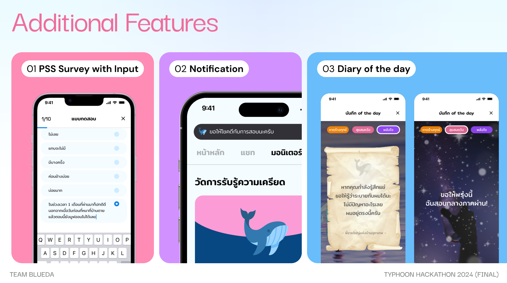

# OceanSpace : Your Digital Sanctuary for Stress Relief
[[`Slides`](https://www.figma.com/deck/TlA4E86wSU4GRxtJ0nB0XD)]

> Contributors: Pidchayanin Chutipattana (Product Owner), Watit Hathaisirikul (Project Manager), Pimpisut Chanpanich (UXUI Designer), Noppanat Wadlom (ML+App Dev), Sorn Chottananurak (ML+App Dev)

## Overview
In Thailand, for every 2 million receiving mental health care, up to 10 million struggle silently—five times the visible number.* Stress is often unspoken, with many lacking a safe space to express their worries. Young people, in particular, may feel their stress is dismissed and remain unaware of how to seek help. This hidden burden profoundly affects their health, productivity, and overall well-being.

Inspired by the Thai sentiment, 'When stressed, I just want to sit and relax by the sea,' OceanSpace offers a digital escape to the calming and expansive ocean. OceanSpace provides a safe, confidential, and comforting sanctuary where users can find relief from stress. By exploring features deeply connected with Thai culture,
we offer a soothing break from the pressures of everyday life, creating personalized and engaging experiences tailored to Thai users.

## Features

## Implementation Details

## About Typhoon Hackathon 2024
[[`Website`](https://www.scb.co.th/en/about-us/news/may-2024/typhoon-hackathon-2024.html)]

The Typhoon Hackathon 2024, organized by SCBX Group and SCB 10X, is a prestigious event centered on developing innovative AI solutions to enhance the use and representation of the Thai language and culture. This year's theme, "Empowering Thai Language AI for Inclusivity," emphasizes creating inclusive, accessible technologies that reflect the richness and diversity of the Thai language.

The hackathon provides an incredible opportunity for participants to collaborate with esteemed partners, including Microsoft, AI Singapore, DataX, Vidyasirimedhi Institute of Science and Technology (VISTEC), VISAI.ai, and Gowajee.ai. These partnerships empower teams with cutting-edge resources and mentorship, fostering an environment ripe for groundbreaking advancements in AI.

We are thrilled to announce that OceanSpace has been selected as one of the top six finalists in this highly competitive event. This recognition is a testament to our team's dedication to driving forward AI research and its application in promoting Thai culture and language inclusivity.
